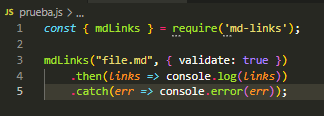
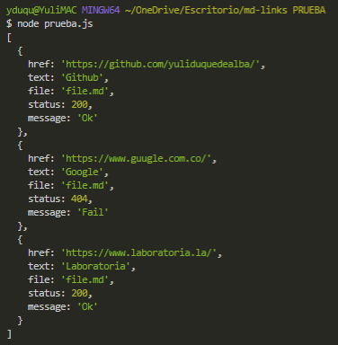
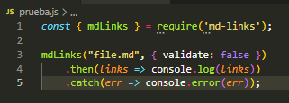
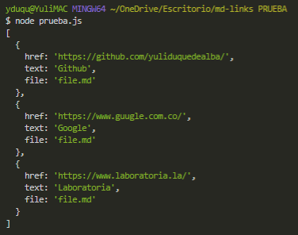
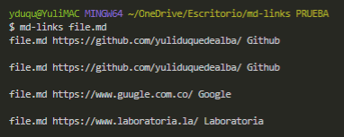
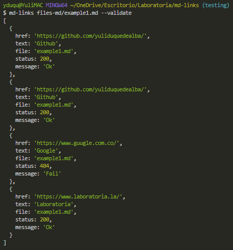
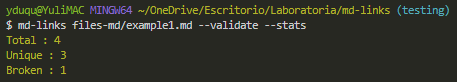
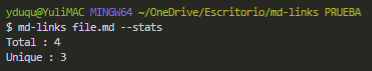

# Markdown Links 🔗

## Índice

* [1. Md-Links](#1-md-links)
* [2. Installation](#2-installation)
* [3. User guide](#3-user-guide)
* [4. Flowchart](#4-flowchart)
* [5. Backlog](#5-backlog)
* [6. Author](#6-author)

***

## 1. Md-Links

### Yes, another library, but different from all the previous ones 📚

MD-LINKS is a library and a command line tool (CLI) executable with [Node.js](https://nodejs.org/), which allows identifying, validating and obtaining statistics of the URLs contained in format files. [Markdown](https://en.wikipedia.org/wiki/Markdown)

With MD-LINKS you will be able to read files that contain _links_ (links/links), identify which ones are broken or no longer valid, in order to prevent them from damaging the value of the information you want to share.

## 2. Installation [🛠]

`$ npm install yuliduquedealba/md-links`

## 3. User guide [💻]

#### API:

`const { mdLinks } = require('md-links');`

*If you want to validate the links found in your `.md` files you can use the `{ validate: true }` property as follows:*

*Return value:*

*If you only want to see the links found in your `.md` files you can change the property to `{ validate: false }`:*

*Return value:*

#### CLI (Command Line Interface):

`md-links <path-to-file>`

`md-links <path-to-file> --validate or --v`

`md-links <path-to-file> --validate --stats or --v --s`

`md-links <path-to-file> --stats or --s`

## 4. Flowchart [🔁]

  

Watch

  

## 5. Backlog [📝]

The [backlog](https://github.com/yuliduquedealba/md-links/projects/1) was implemented with Github Projects

## 6. Author [👩‍💻]

[Yulimar Duque](https://www.linkedin.com/in/yulimarduque/) front-end developer