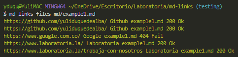
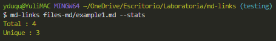

# Markdown Links

## Índice

* [1. md-links](#1-md-links)
* [2. Installation](#2-installation)
* [3. User guide](#3-user-guide)
* [4. Flowchart](#4-Flowchart)
* [5. Backlog](#5-backlog)
* [6. Author](#6-author)
* [7. Fuentes](#7-fuentes)

***

## 1. MD-LINKS

### Yes, another library, but different from all the previous ones 📚

MD-LINKS is a library and a command line tool (CLI) executable with [Node.js](https://nodejs.org/), which allows identifying, validating and obtaining statistics of the URLs contained in format files. [Markdown](https://en.wikipedia.org/wiki/Markdown)

With MD-LINKS you will be able to read files that contain _links_ (links/links), identify which ones are broken or no longer valid, in order to prevent them from damaging the value of the information you want to share.

## 2. Installation

`$ npm install yuliduquedealba/md-links`

## 3. User guide

**Library:**

`const { mdLinks } = require('md-links');`

**CLI (Command Line Interface):**

`md-links <path-to-file>`

{width=100%}

`md-links <path-to-file> --validate`

{width=100%}

`md-links <path-to-file> --stats`

{width=100%}

`md-links <path-to-file> --validate --stats o --stats --validate`

{width=100%}

## 4. Flowchart

  

Watch

  * [Flowchart](https://curriculum.laboratoria.la/es/topics/javascript/04-arrays)
  

## 5. Backlog

El [backlog](img/Diagrama%20de%20flujo.png) fue implementado con Github Projets

## 6. Author

[Yulimar Duque](https://www.linkedin.com/in/yulimarduque/) front-end developer